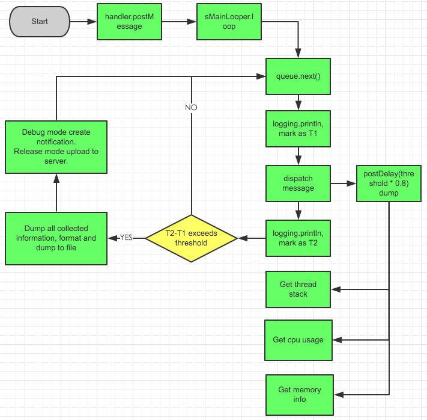
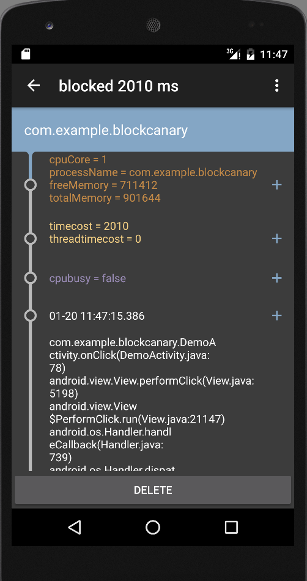
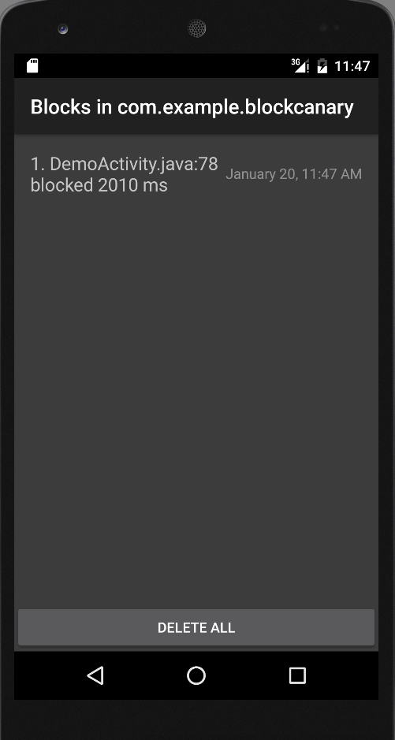

[Chinese README](https://github.com/markzhai/AndroidPerformanceMonitor/blob/master/README_CN.md)

# Android Performance Monitor [](https://maven-badges.herokuapp.com/maven-central/com.github.markzhai/blockcanary-android)
A transparent ui-block detection library for Android, app only needs one-line-code to setup.

The naming is to pay respect to the great library [LeakCanary](https://github.com/square/leakcanary), ui-related codes are modified from leakcanary's ui part.

- 1.5.0 Add context that can stop monitor in debug mode.
- 1.4.1 Bug fix.
- 1.4.0 Bug fix, add onBlock interceptor in context.
- 1.3.1 Enable configuration of label and icon.
- 1.3.0 Add white-list and concern-package feature.

# Getting started

You may choose how to assemble them as you like.

```gradle
dependencies {
    // most often used way, enable notification to notify block event
    compile 'com.github.markzhai:blockcanary-android:1.5.0'

    // this way you only enable BlockCanary in debug package
    // debugCompile 'com.github.markzhai:blockcanary-android:1.5.0'
    // releaseCompile 'com.github.markzhai:blockcanary-no-op:1.5.0'
}
```

As this library uses `getMainLooper().setMessageLogging()`, please check if you set it in your app (related issue https://github.com/moduth/blockcanary/issues/27)

# Usage

Maximum log count is set to 500, you can rewrite it in your app `int.xml`.
```xml
<integer name="block_canary_max_stored_count">1000</integer>
```

Monitor app's label and icon can be configured by placing a `block_canary_icon` drawable in your xhdpi drawable directory and in `strings.xml`:
```xml
<string name="block_canary_display_activity_label">Blocks</string>
```

```java
public class DemoApplication extends Application {
    @Override
    public void onCreate() {
        // ...
        // Do it on main process
        BlockCanary.install(this, new AppBlockCanaryContext()).start();
    }
}
```

Implement your application `BlockCanaryContext` context (strongly recommend you to check all these configs)：
```java
public class AppBlockCanaryContext extends BlockCanaryContext {

    /**
     * Implement in your project.
     *
     * @return Qualifier which can specify this installation, like version + flavor.
     */
    public String provideQualifier() {
        return "unknown";
    }

    /**
     * Implement in your project.
     *
     * @return user id
     */
    public String provideUid() {
        return "uid";
    }

    /**
     * Network type
     *
     * @return {@link String} like 2G, 3G, 4G, wifi, etc.
     */
    public String provideNetworkType() {
        return "unknown";
    }

    /**
     * Config monitor duration, after this time BlockCanary will stop, use
     * with {@code BlockCanary}'s isMonitorDurationEnd
     *
     * @return monitor last duration (in hour)
     */
    public int provideMonitorDuration() {
        return -1;
    }

    /**
     * Config block threshold (in millis), dispatch over this duration is regarded as a BLOCK. You may set it
     * from performance of device.
     *
     * @return threshold in mills
     */
    public int provideBlockThreshold() {
        return 1000;
    }

    /**
     * Thread stack dump interval, use when block happens, BlockCanary will dump on main thread
     * stack according to current sample cycle.
     * <p>
     * Because the implementation mechanism of Looper, real dump interval would be longer than
     * the period specified here (especially when cpu is busier).
     * </p>
     *
     * @return dump interval (in millis)
     */
    public int provideDumpInterval() {
        return provideBlockThreshold();
    }

    /**
     * Path to save log, like "/blockcanary/", will save to sdcard if can.
     *
     * @return path of log files
     */
    public String providePath() {
        return "/blockcanary/";
    }

    /**
     * If need notification to notice block.
     *
     * @return true if need, else if not need.
     */
    public boolean displayNotification() {
        return true;
    }

    /**
     * Implement in your project, bundle files into a zip file.
     *
     * @param src  files before compress
     * @param dest files compressed
     * @return true if compression is successful
     */
    public boolean zip(File[] src, File dest) {
        return false;
    }

    /**
     * Implement in your project, bundled log files.
     *
     * @param zippedFile zipped file
     */
    public void upload(File zippedFile) {
        throw new UnsupportedOperationException();
    }


    /**
     * Packages that developer concern, by default it uses process name,
     * put high priority one in pre-order.
     *
     * @return null if simply concern only package with process name.
     */
    public List<String> concernPackages() {
        return null;
    }

    /**
     * Filter stack without any in concern package, used with @{code concernPackages}.
     *
     * @return true if filter, false it not.
     */
    public boolean filterNonConcernStack() {
        return false;
    }

    /**
     * Provide white list, entry in white list will not be shown in ui list.
     *
     * @return return null if you don't need white-list filter.
     */
    public List<String> provideWhiteList() {
        LinkedList<String> whiteList = new LinkedList<>();
        whiteList.add("org.chromium");
        return whiteList;
    }

    /**
     * Whether to delete files whose stack is in white list, used with white-list.
     *
     * @return true if delete, false it not.
     */
    public boolean deleteFilesInWhiteList() {
        return true;
    }

    /**
     * Block interceptor, developer may provide their own actions.
     */
    public void onBlock(Context context, BlockInfo blockInfo) {

    }
}
```

# How does it work?
Blog in Chinese: [BlockCanary](http://blog.zhaiyifan.cn/2016/01/16/BlockCanaryTransparentPerformanceMonitor/).

Principle flow picture:



# Screenshot




# Donation

If you find this repository helpful, you may make a donation to me via alipay or wechat.
 

# Contributors

This library is initially created by [markzhai](https://github.com/markzhai), and maintained under the organization [moduth](https://github.com/moduth) with [nimengbo](https://github.com/nimengbo) and [zzz40500](https://github.com/zzz40500).

Special thanks to [android-cjj](https://github.com/android-cjj), [Mr.Bao](https://github.com/baoyongzhang), [chiahaolu](https://github.com/chiahaolu) to contribute.

# Change Log

Check [CHANGELOG](https://github.com/markzhai/AndroidPerformanceMonitor/blob/master/CHANGELOG.md)

# Contribute

If you would like to contribute code to BlockCanary you can do so through GitHub by forking the repository and sending a pull request.

# License

    Copyright (C) 2016 MarkZhai (http://zhaiyifan.cn).

    Licensed under the Apache License, Version 2.0 (the "License");
    you may not use this file except in compliance with the License.
    You may obtain a copy of the License at

       http://www.apache.org/licenses/LICENSE-2.0

    Unless required by applicable law or agreed to in writing, software
    distributed under the License is distributed on an "AS IS" BASIS,
    WITHOUT WARRANTIES OR CONDITIONS OF ANY KIND, either express or implied.
    See the License for the specific language governing permissions and
    limitations under the License.
